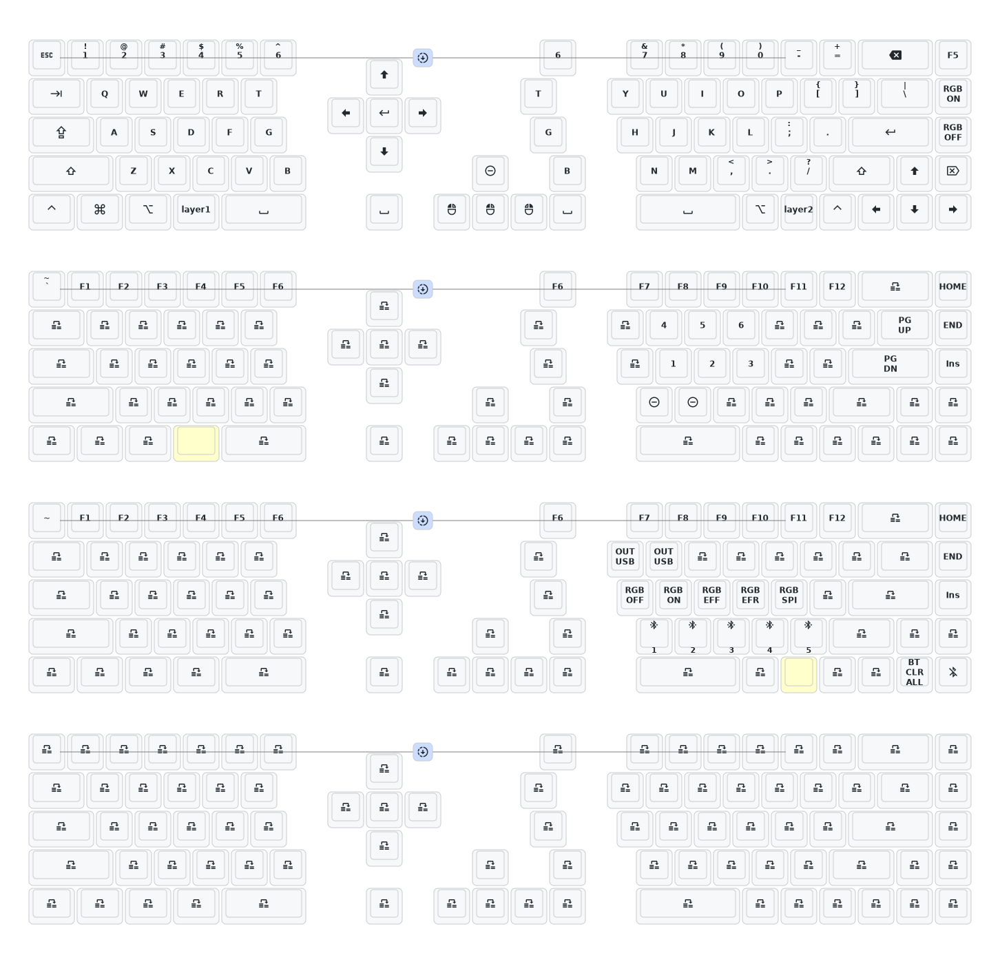

2026/5/21 重大更新 offset无接收器版本适配了dya-studio 比ZMK-studio好用一些。可以下载当前版本的新固件，以便支持dya-studio.另附dya-studio的下载链接https://github.com/tokyo2006/dya-studio/actions/runs/25962140568     目前有windows 和macos两个版本。
          Update: The offset version without dongle is compatible with dya-studio and works slightly better than ZMK-studio. You can download the latest firmware to support dya-studio.The download link for dya-studio is https://github.com/tokyo2006/dya-studio/actions/runs/25962140568.  Two versions available: Windows and MacOS.
          The website of dya studio:https://studio.dya.cormoran.works/
## Offsetkey 键位图

